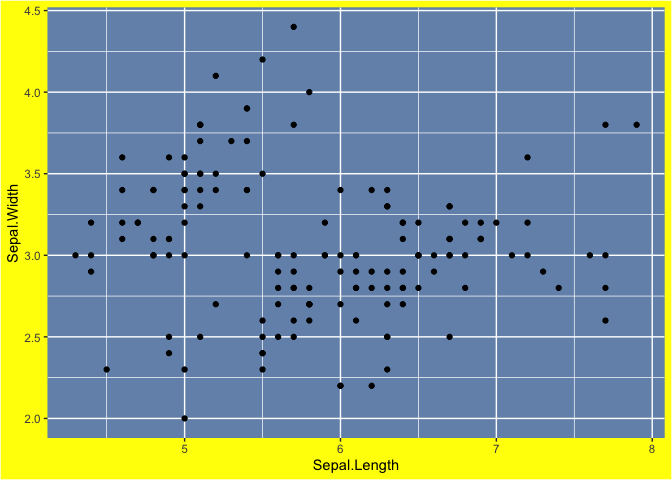

Rython - R Code
================
Andrew Patton

## 0\) Load iris as dataframe

``` r
data(iris)
```

## 1\) Split data into train/test sets

Via: [Kyle Ligon](https://twitter.com/redickio)

``` r
library(dplyr)
library(tidymodels)

iris_split <- iris %>% 
  initial_split(prop = 0.75)

train_iris <- training(iris_split)
test_iris <- testing(iris_split)

print(nrow(train_iris))
```

    ## [1] 113

``` r
print(nrow(test_iris))
```

    ## [1] 37

## 2\) Split a dataframe into parts based on levels of a categorical variable

``` r
split_list <- split(iris, iris$Species)

setosa <- split_list[['setosa']]
versicolor <- split_list[['versicolor']]
virginica <- split_list[['virginica']]
```

## 3\) Conditional column creation/editing

``` r
library(dplyr)

iris %>% 
  mutate(new_column_basic = 'cat') %>% 
  mutate(new_column_conditional = ifelse(Species == "setosa", "this is setosa", 'this is not')) %>%
  slice_sample(prop = 1) %>% ## just to scrable the order
  head()
```

    ##   Sepal.Length Sepal.Width Petal.Length Petal.Width    Species new_column_basic
    ## 1          5.1         3.5          1.4         0.3     setosa              cat
    ## 2          5.1         2.5          3.0         1.1 versicolor              cat
    ## 3          6.7         3.0          5.2         2.3  virginica              cat
    ## 4          6.3         2.8          5.1         1.5  virginica              cat
    ## 5          6.8         3.0          5.5         2.1  virginica              cat
    ## 6          5.4         3.0          4.5         1.5 versicolor              cat
    ##   new_column_conditional
    ## 1         this is setosa
    ## 2            this is not
    ## 3            this is not
    ## 4            this is not
    ## 5            this is not
    ## 6            this is not

## 4\) Change the background of plot

``` r
library(ggplot2)

ggplot(data = iris, aes(x = Sepal.Length, y = Sepal.Width)) +
  geom_point() +
  theme(plot.background = element_rect(fill = 'yellow'), ## string for color
        panel.background = element_rect(fill = '#7392B7')) ## hex for color
```

<!-- -->

## 5\) Grouped aggregations with multiple functions and variables

``` r
## can just add more variables to group_by call as well
iris %>% 
  group_by(Species) %>% 
  summarise(n = n(),
            sepal_length_sum = sum(Sepal.Length),
            sepal_width_mean = mean(Sepal.Width),
            petal_length_max = max(Petal.Length))
```

    ## # A tibble: 3 x 5
    ##   Species        n sepal_length_sum sepal_width_mean petal_length_max
    ##   <fct>      <int>            <dbl>            <dbl>            <dbl>
    ## 1 setosa        50             250.             3.43              1.9
    ## 2 versicolor    50             297.             2.77              5.1
    ## 3 virginica     50             329.             2.97              6.9

## 6\) Get a linear regression summary table

``` r
## y ~ x
model = lm(Sepal.Length ~ Sepal.Width, data = iris)
summary(model)
```

    ## 
    ## Call:
    ## lm(formula = Sepal.Length ~ Sepal.Width, data = iris)
    ## 
    ## Residuals:
    ##     Min      1Q  Median      3Q     Max 
    ## -1.5561 -0.6333 -0.1120  0.5579  2.2226 
    ## 
    ## Coefficients:
    ##             Estimate Std. Error t value Pr(>|t|)    
    ## (Intercept)   6.5262     0.4789   13.63   <2e-16 ***
    ## Sepal.Width  -0.2234     0.1551   -1.44    0.152    
    ## ---
    ## Signif. codes:  0 '***' 0.001 '**' 0.01 '*' 0.05 '.' 0.1 ' ' 1
    ## 
    ## Residual standard error: 0.8251 on 148 degrees of freedom
    ## Multiple R-squared:  0.01382,    Adjusted R-squared:  0.007159 
    ## F-statistic: 2.074 on 1 and 148 DF,  p-value: 0.1519
